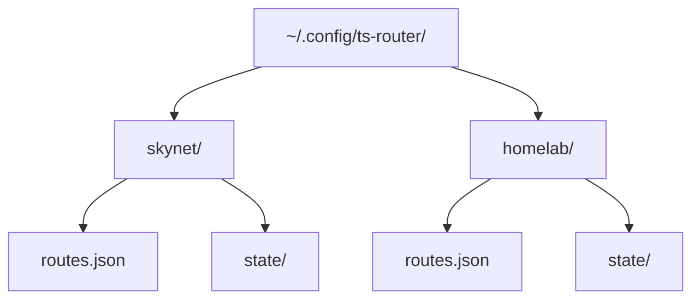
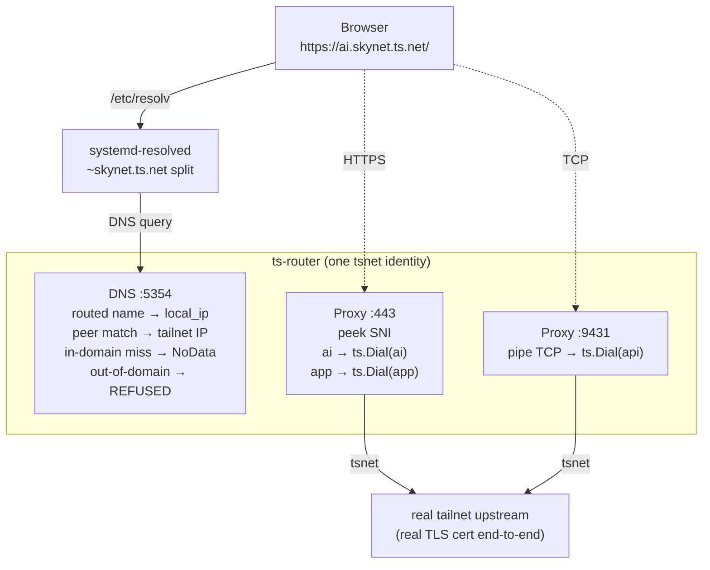

# ts-router Guide

**ts-router** is a multi-host successor to ts-unplug. One process, one tailnet identity, many local listeners — plus a built-in DNS responder so the original URLs work in your browser.

## Overview

ts-router lets a workstation reach an arbitrary number of tailnet hostnames *as if they were local*, with real upstream certificates and no system tailscaled required. It does three things:

- **TCP passthrough** for plain TCP services on dedicated ports (e.g. `api:9431`).
- **TLS SNI dispatch** so many `https://` hosts can share a single local `:443` listener, each terminating to its real upstream with its real cert.
- **DNS responder** so the original `https://ai.skynet.ts.net/` URL resolves to localhost without `/etc/hosts` edits.

Unlike ts-unplug (one process per upstream, one tailnet device per process), ts-router collapses everything into a single tsnet identity. Driven by a JSON config file.

## Quick Start

Assumes you've already cloned the repo. From the repo root:

```sh
# 1. Build + install + grant privileged port binding
make ts-router
sudo install -m 0755 build/ts-router /usr/local/bin/ts-router
sudo setcap 'cap_net_bind_service=+ep' /usr/local/bin/ts-router

# 2. Create an instance directory and write a config
mkdir -p ~/.config/ts-router/skynet
cat > ~/.config/ts-router/skynet/routes.json <<'EOF'
{
  "name": "skynet",
  "domain": "skynet.ts.net",
  "dns_listen": "127.0.0.1:5354",
  "local_ip": "127.0.0.1",
  "routes": [
    {"listen": ":443", "sni": "ai.skynet.ts.net",  "upstream": "ai.skynet.ts.net:443"},
    {"listen": ":443", "sni": "app.skynet.ts.net", "upstream": "app.skynet.ts.net:443"},
    {"listen": ":443", "sni": "portal.skynet.ts.net",  "upstream": "portal.skynet.ts.net:443"},
    {"listen": ":9431", "upstream": "api.skynet.ts.net:9431"}
  ]
}
EOF

# 3. Wire systemd-resolved to send skynet.ts.net queries to ts-router (one-time)
sudo ts-router -instance ~/.config/ts-router/skynet install-resolved
sudo systemctl restart systemd-resolved

# 4. Run it (first run prints an auth URL; visit it to join the tailnet)
ts-router -instance ~/.config/ts-router/skynet -hostname tsrouter-skynet-$(hostname -s)
```

Open `https://ai.skynet.ts.net/`, `https://app.skynet.ts.net/`, `http://api.skynet.ts.net:9431/` in your browser — they hit the real upstreams with the real certs.

Discover other tailnet hostnames worth routing:

```sh
ts-router -instance ~/.config/ts-router/skynet peers | grep -i grafana
```

The sections below explain the layout, every config field, the DNS responder behavior, multi-tailnet operation, and how to run it as a systemd user unit.

## Installation

```sh
make ts-router
sudo install -m 0755 build/ts-router /usr/local/bin/ts-router

# Allow binding privileged ports (:80, :443) without root.
# Must be re-applied after every rebuild.
sudo setcap 'cap_net_bind_service=+ep' /usr/local/bin/ts-router
```

## Layout

ts-router is built around an *instance directory* — one folder per tailnet, containing both routes and tsnet state:



This means deleting a tailnet is `rm -rf ~/.config/ts-router/<name>`, and backing one up is `tar`.

## Configuration

### Top-level fields

| Field | Required | Description |
|-------|----------|-------------|
| `name` | yes (for `*-resolved` subcommands and DNS) | Instance name. Used to compute the `/etc/systemd/resolved.conf.d/` drop-in filename. |
| `domain` | yes (for DNS) | The DNS suffix this instance owns, e.g. `skynet.ts.net`. |
| `dns_listen` | optional | Local address for the DNS responder (e.g. `127.0.0.1:5354`). If empty, the DNS responder is disabled. |
| `local_ip` | optional | Address returned by the DNS responder for routed names. Defaults to `127.0.0.1`. |
| `routes` | yes | List of routes (see below). |

### Route fields

| Field | Required | Description |
|-------|----------|-------------|
| `listen` | yes | Local listen address, e.g. `":443"` or `"127.0.0.1:9431"`. |
| `upstream` | yes | Tailnet `host:port` to forward to. |
| `sni` | optional | If set, the route is part of a TLS SNI dispatcher on that `listen` address. |

### Modes per listen address

- A listen address with **one route and no `sni`** is a raw **TCP forwarder**.
- A listen address with **one or more `sni` routes** is a **TLS SNI dispatcher**. Each connection's ClientHello is peeked, the SNI is matched against the route's `sni` field, and the connection is piped to the matching upstream.
- Mixing tcp and sni routes on the same listen is rejected at startup.

The DNS responder auto-derives the set of local hostnames from the routes: for SNI routes, the `sni` value; for TCP routes, the host part of `upstream`.

## How It Works



The connection between browser and upstream is TLS end-to-end — ts-router never terminates or re-issues a cert. The browser validates the real `*.skynet.ts.net` certificate.

## Flags

```
-instance string     instance directory; sets -config to <dir>/routes.json and -dir to <dir>/state
-config string       path to JSON routes config (alternative to -instance)
-dir string          tsnet server directory (alternative to -instance)
-hostname string     hostname for the tsnet server (default "tsrouter")
-debug-tsnet         enable tsnet.Server logging
```

`-instance` and `-config`/`-dir` are mutually exclusive.

## Subcommands

```
ts-router [flags]                    run proxy + DNS responder (default)
ts-router [flags] peers              list tailnet peers visible to this tsnet identity
ts-router [flags] print-resolved     print systemd-resolved drop-in to stdout
ts-router [flags] install-resolved   write systemd-resolved drop-in (requires root)
ts-router [flags] uninstall-resolved remove systemd-resolved drop-in (requires root)
```

### peers

Brings up tsnet just long enough to query `LocalClient.Status()`, prints every visible tailnet peer with its IPs and online state, exits. Useful for discovery — find the exact `DNSName` of a host before adding it to `routes.json`.

```sh
ts-router -dir ./state peers | grep -i grafana
```

`peers` doesn't need `-config` — just state.

### print-resolved / install-resolved / uninstall-resolved

These manage a per-instance drop-in at `/etc/systemd/resolved.conf.d/ts-router-<name>.conf` containing:

```ini
[Resolve]
DNS=<dns_listen>
Domains=~<domain>
```

- `print-resolved` writes the drop-in content to stdout. No side effects, no root.
- `install-resolved` writes the file (root required). **It does not restart systemd-resolved** — by design. It prints the command for you to run, so the restart is your explicit, auditable step.
- `uninstall-resolved` removes the file (root required). Same restart-yourself policy.

`install-resolved` is idempotent: if the file already exists with identical content, it's a no-op.

## DNS Responder

When `dns_listen` is set, ts-router runs a small DNS server on that address (UDP + TCP). Per query:

| Query | Response |
|-------|----------|
| Routed name (in your `routes`) | `A = local_ip` (`AAAA = NoData` for v4 local_ip) |
| In-domain name matching a tailnet peer's `DNSName` | The peer's `TailscaleIPs` (filtered by query type) |
| In-domain name with no match | NOERROR with empty answer (NoData) |
| Out-of-domain | REFUSED |
| Non-A/AAAA query | NOTIMPL |

The peer-lookup path goes through `LocalClient.Status()` — no host tailscaled or `100.100.100.100` involvement. tsnet itself is a full Tailscale node and knows every peer.

**Note**: peer lookup catches real tsnet peer devices. Admin-side "additional records" (synthetic A records configured in the Tailscale admin console) won't appear there — for those, add them explicitly to `routes`.

### Port 53 / mDNS conflict

`:5353` is the standard mDNS port and is usually claimed by avahi or Chrome on a desktop. Use `:5354` (or any other) for `dns_listen`. The systemd-resolved drop-in references whatever `dns_listen` you set, so the two stay consistent automatically.

## systemd-resolved Setup

`/etc/resolv.conf` is managed by systemd-resolved on most modern Linux desktops, so the right way to intercept queries for one domain is a `resolved.conf.d` drop-in. ts-router does this for you:

```sh
sudo ts-router -instance ~/.config/ts-router/skynet install-resolved
sudo systemctl restart systemd-resolved
```

The drop-in tells systemd-resolved: "send queries matching `~skynet.ts.net` to ts-router; leave everything else alone." Tailscale's own MagicDNS continues to handle other `*.ts.net` names via the standard longest-match rule.

### Without systemd-resolved (or to avoid the dance)

If you're not running systemd-resolved (or just want a simpler setup), skip `dns_listen`/the resolved subcommands entirely and use `/etc/hosts`:

```
127.0.0.1  ai.skynet.ts.net app.skynet.ts.net portal.skynet.ts.net api.skynet.ts.net
```

You give up dynamic peer discovery in DNS, but routed names work the same way.

## Multi-Tailnet

Each tailnet gets its own instance directory and its own tsnet identity. Run them concurrently — they share nothing:

```sh
ts-router -instance ~/.config/ts-router/skynet     -hostname tsrouter-skynet     &
ts-router -instance ~/.config/ts-router/homelab  -hostname tsrouter-homelab  &
```

Each instance:
- Owns its own DNS port (different `dns_listen` per config)
- Owns its own listen IP if both bind `:443` (set `"listen": "127.0.0.10:443"` for one and `"127.0.0.20:443"` for the other; Linux routes all of `127.0.0.0/8` to lo)
- Gets its own `resolved.conf.d` drop-in (filename derives from `name`)

### Two tailnets, both on :443

```
~/.config/ts-router/skynet/routes.json:
  "local_ip": "127.0.0.10",
  "dns_listen": "127.0.0.1:5354",
  "routes": [{"listen": "127.0.0.10:443", "sni": "ai.skynet.ts.net", ...}]

~/.config/ts-router/homelab/routes.json:
  "local_ip": "127.0.0.20",
  "dns_listen": "127.0.0.1:5355",
  "routes": [{"listen": "127.0.0.20:443", "sni": "nas.homelab.ts.net", ...}]
```

The DNS responder for each returns its own `local_ip`, so resolution and listener stay matched.

## Running as a systemd User Unit

`~/.config/systemd/user/ts-router-skynet.service`:

```ini
[Unit]
Description=ts-router (skynet)
After=network-online.target

[Service]
ExecStart=/usr/local/bin/ts-router -instance %h/.config/ts-router/skynet -hostname tsrouter-skynet-%H
Restart=on-failure
RestartSec=5

[Install]
WantedBy=default.target
```

```sh
systemctl --user daemon-reload
systemctl --user enable --now ts-router-skynet
loginctl enable-linger $USER          # start at boot, not just login
journalctl --user -u ts-router-skynet -f
```

`%H` expands to the host's short name, so the tsnet device shows up as `tsrouter-skynet-<hostname>` in the Tailscale admin.

## Security Considerations

- **TLS is end-to-end.** ts-router does not terminate or re-sign certificates. The browser validates the real upstream cert. SNI is the only TLS field ts-router reads.
- **No system tailscaled dependency.** ts-router runs its own userspace Tailscale node. State lives in the instance's `state/` directory (`chmod 700` recommended).
- **DNS responder binds to `127.0.0.1` only by default.** Don't bind it to a routable address without thinking through whether peers should be able to query you.
- **`install-resolved` requires root** for the obvious reason — it writes to `/etc/`. The binary uses `cap_net_bind_service` for privileged ports rather than running as root for the proxy itself.

## Troubleshooting

### `dig` returns SERVFAIL for known names

Almost always means two ts-router (or ts-unplug) processes are running against the same state directory. Each tsnet expects exclusive ownership; conflicts manifest as a broken internal resolver. Kill the duplicate and the survivor recovers.

### `connection refused` on the DNS port

Check `getent hosts <name>` — if it returns the right `local_ip`, systemd-resolved is set up. If not, your drop-in isn't active. Verify with `resolvectl domain` and `resolvectl status`.

### Port `:443` won't bind

You forgot to `setcap` after a rebuild. Re-run:

```sh
sudo setcap 'cap_net_bind_service=+ep' /usr/local/bin/ts-router
```

### Browser shows a cert warning

ts-router is *not* doing TLS termination. If the cert looks wrong, the upstream itself is serving an unexpected cert (e.g. you pointed `upstream` at the wrong host). Test the upstream directly:

```sh
curl -v --resolve <name>:443:127.0.0.1 https://<name>/
```

### `peers` shows the host but DNS returns empty

The host probably has only an IPv6 tailnet IP and you asked for A (or vice versa). Try the other family. If `peers` shows both — bug; file an issue.

### A name in `go/` shortlinks doesn't resolve

`go/` shortlinks can point at hostnames that are admin-side "additional A records" rather than real tsnet peer devices. Those don't show up in `peers`. The fix is simple — add the host to `routes.json` explicitly. Once it's a route, the DNS responder maps it to `local_ip` and the TCP forwarder uses `ts.Dial`, which resolves it through tsnet's internal MagicDNS (separate code path).

## Comparison

| Feature | ts-plug | ts-unplug | ts-router |
|---------|---------|-----------|-----------|
| Direction | local → tailnet | tailnet → local | tailnet → local |
| Upstreams per process | 1 | 1 | many |
| Tailnet devices per process | 1 | 1 | 1 |
| TLS termination | yes (own cert) | no | no (end-to-end SNI passthrough) |
| Built-in DNS | optional | no | yes |
| Config | flags only | flags only | JSON file |

## See Also

- [ts-plug Guide](./ts-plug.md) — share local services to your tailnet
- [ts-unplug Guide](./ts-unplug.md) — single-upstream tailnet → local
- [Main README](../README.md)
